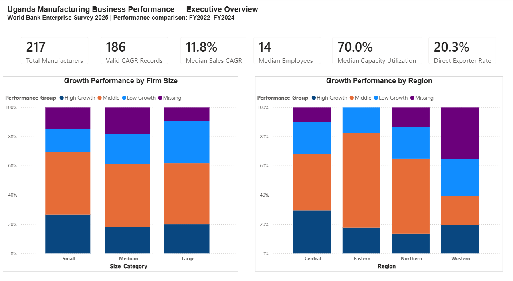
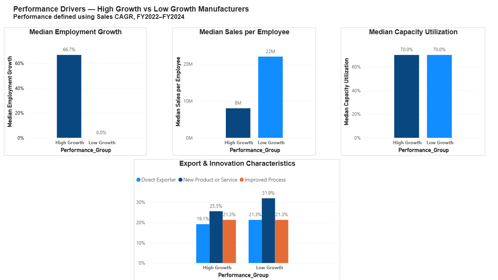
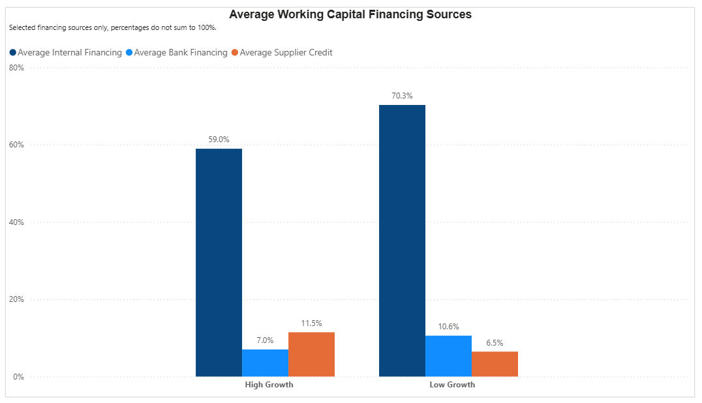
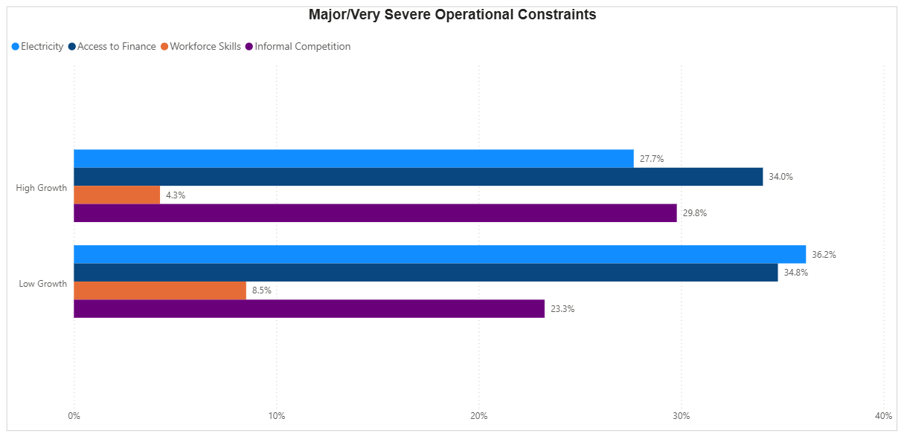

# Uganda Manufacturing Business Performance Analysis

A manufacturing performance analysis using **Excel, MySQL, and Power BI** to compare high- and low-growth firms, examine financing and investment patterns, and identify operational constraints affecting Ugandan manufacturers using the World Bank Enterprise Survey 2025.

---

## Background and Overview

The **Uganda Manufacturing Business Performance Analysis** examines firm-level data from the 2025 World Bank Enterprise Survey to understand what separates higher-growth manufacturers from lower-growth firms.

I focused on the manufacturing segment of the survey and prepared a working dataset of **217 establishments**. The analysis compares firm performance using sales growth between FY2022 and FY2024, then looks at the business factors linked to stronger or weaker results.

The analysis was completed using **Excel and Power Query** for data preparation and exploratory analysis, **MySQL** for SQL-based analysis, and **Power BI** for data modeling, DAX calculations, and dashboard development.

### Key Areas of Analysis

- **Performance Drivers:** Compares High Growth and Low Growth manufacturers across employment growth, sales per employee, capacity utilization, exports, innovation, firm size, and region.
- **Finance and Investment:** Examines working-capital financing, financial-institution loans, fixed-asset purchases, and equipment investment.
- **Operational Constraints:** Assesses electricity, access to finance, workforce skills, informal competition, and power outages to identify the constraints most closely associated with weaker growth.

The goal was to turn the survey data into findings that help you understand how firm characteristics, financing decisions, investment activity, and operating conditions relate to manufacturing performance.

### Project Files

- **The interactive Power BI dashboard for this project can be downloaded** [here](powerbi/Uganda_Manufacturing_Business_Performance_2025.pbix)
- **The SQL queries used for data quality checks and dataset validation can be found** [here](sql/uganda_manufacturing_2025_Data_Quality_Checks.sql)
- **Target SQL queries used to create the analytical views regarding the 3 business questions can be found** [here](sql/uganda_manufacturing_2025_Analysis.sql)
- **The Excel workbook used for data cleaning, validation, and exploratory analysis can be downloaded** [here](excel/Uganda_Manufacturing_2025_Working_Dataset.xlsx)
- **The Key Findings Excel workbook summarizing the main insights can be downloaded** [here](excel/Uganda_Manufacturing_Final_Key_Findings.xlsx)

---

## Data Structure Overview

The final analytical dataset consists of one cleaned table, `manufacturing_clean`, containing **217 Ugandan manufacturing establishments and 52 fields**. Each row represents one establishment. The columns cover firm characteristics, financial performance, employment, financing, investment, exports, innovation, and operational constraints.

Because the project uses a single analysis-ready table, there is no multi-table relationship model or ERD. The dataset uses a flat structure that works across Excel, MySQL, and Power BI.

### Main Data Areas Include

- **Firm Profile:** Region, firm size, manufacturing subsector, year started, and manager experience.
- **Performance:** Annual sales, Sales CAGR, employment growth, sales per employee, and capacity utilization.
- **Finance and Investment:** Internal financing, bank financing, supplier credit, loan status, fixed-asset purchases, and equipment investment.
- **Exports and Innovation:** Direct export activity, new product or service introduction, and process improvement.
- **Operational Constraints:** Electricity, access to finance, workforce skills, informal competition, and monthly power outages.

Before starting the analysis, I carried out data-quality checks to confirm row counts, duplicate IDs, missing Sales CAGR values, NULL handling, and performance-group counts.

The SQL queries used for these checks can be found [here](sql/uganda_manufacturing_2025_Data_Quality_Checks.sql).

---

## Executive Summary

The analysis shows clear differences between High Growth and Low Growth Ugandan manufacturers over FY2022–FY2024. Of the **217 manufacturing establishments** in the sample, **186** had enough sales data to calculate Sales CAGR, with a median CAGR of **11.8%**.

High Growth firms expanded employment much faster, relied less on internal financing, and faced fewer electricity-related disruptions. Low Growth firms were more likely to hold financial-institution loans and reported more frequent power outages. Capacity utilization, firm age, and manager experience showed little difference between the two groups.

### Three Findings Stand Out:

- **Performance:** High Growth firms recorded much stronger employment growth, while capacity utilization remained similar across both groups.
- **Finance and investment:** High Growth firms relied less on internal working-capital financing, while Low Growth firms were more likely to have financial-institution loans.
- **Operational constraints:** Electricity showed the clearest link with weaker performance, with Low Growth firms reporting more frequent outages and higher electricity-related constraints.

Overall, the analysis indicates that manufacturers should focus on **workforce productivity, financing decisions, investment returns, and reducing the impact of electricity outages on operations**.

### Dashboard Overview

The full interactive Power BI dashboard can be downloaded [here](powerbi/Uganda_Manufacturing_Business_Performance_2025.pbix).

---

## Insights Deep Dive

### Performance Drivers

**Employment growth was the clearest difference between High Growth and Low Growth firms.** High Growth manufacturers recorded median employment growth of **66.7%**, compared with **0.0%** among Low Growth firms. This suggests that firms with stronger sales growth were also expanding their workforce much faster.

**Capacity utilization was almost identical across the two groups.** Both High Growth and Low Growth firms recorded a median capacity utilization rate of **70%**. Higher sales growth therefore did not appear to come from simply running existing production capacity harder.

**Sales per employee was lower among High Growth firms.** Median sales per employee was about **UGX 8 million** for High Growth firms, compared with roughly **UGX 22 million** for Low Growth firms. This may reflect rapid hiring among growing firms, where employment increased faster than sales per worker.

**Firm age and manager experience showed little difference.** Median firm age was **17 years** in both groups, while median manager experience was **20 years for High Growth firms and 19.5 years for Low Growth firms**. These factors did not clearly separate stronger and weaker performers.

---

### Finance and Investment

**High Growth firms depended less on internal financing.** Median internal working-capital financing was **60% for High Growth firms**, compared with **80% for Low Growth firms**. Average internal financing showed the same pattern.

**Low Growth firms were more likely to hold financial-institution loans.** About **42.6% of Low Growth firms** had a financial-institution loan, compared with **27.7% of High Growth firms**. This shows that access to debt alone did not correspond with stronger sales growth.

**Fixed-asset purchasing rates were almost the same.** Around **25.5% of High Growth firms** purchased fixed assets, compared with **23.4% of Low Growth firms**. The decision to invest in fixed assets therefore did not separate the two groups strongly.

**Investment intensity told a different story among firms that did invest.** Median equipment investment represented **3.5% of sales for High Growth investors**, compared with **2.1% for Low Growth investors**. While Low Growth firms recorded higher absolute median equipment investment, High Growth firms committed a larger share of sales to equipment.

---

### Operational Constraints

**Electricity was the clearest operational difference between the two growth groups.** About **36.2% of Low Growth firms** rated electricity as a Major or Very Severe obstacle, compared with **27.7% of High Growth firms**.

**Low Growth firms also faced more power outages.** Around **80.9% of Low Growth firms** reported experiencing outages, compared with **74.5% of High Growth firms**.

The difference was more noticeable when outage frequency was compared. Low Growth firms recorded a median of **5 outages per month**, while High Growth firms recorded **3**. Among firms that experienced outages, the median increased to **6.5 outages per month for Low Growth firms** and **5 for High Growth firms**.

**Electricity was also more likely to be named as the single biggest obstacle by Low Growth firms.** About **27.7% of Low Growth firms** selected electricity as their biggest business obstacle, compared with **12.8% of High Growth firms**.

**Access to finance was common across both groups but did not clearly separate performance.** Major or Very Severe finance constraints affected **34.8% of Low Growth firms** and **34.0% of High Growth firms**.

**Informal competition showed the opposite pattern.** Around **29.8% of High Growth firms** rated informal competition as Major or Very Severe, compared with **23.3% of Low Growth firms**. This suggests that informal competition was not closely linked to weaker growth in this sample.

---

## Recommendations

Based on the insights uncovered in the analysis, the following actions should be prioritized:

- **Strengthen electricity resilience:** Low Growth firms reported higher outage exposure (**80.9% vs 74.5%**) and more frequent outages, so manufacturers should assess backup power, alternative energy, and production scheduling where electricity disruptions are common.
- **Monitor workforce productivity:** High Growth firms recorded **66.7% median employment growth**, but lower sales per employee, so, companies should track whether fast workforce expansion is translating into sustainable improvements in output and sales per employee.
- **Improve financing decisions:** Low Growth firms were more likely to hold financial-institution loans (**42.6% vs 27.7%**), while High Growth firms relied less on internal financing. Manufacturers should compare internal funds, supplier credit, bank finance, and other options based on cost, repayment terms, and expected returns.
- **Focus on investment returns:** Fixed-asset purchase rates were similar across growth groups, so firms should measure how equipment purchases affect capacity, productivity, and operating costs rather than treating investment activity alone as a sign of stronger performance.
- **Use segment-specific support:** Performance and operating conditions varied across firm size, region, and subsector, so financing, infrastructure, and business-support decisions should reflect those differences rather than applying one approach to all manufacturers.

---

## Caveats

- **Incomplete growth data:** Sales CAGR could be calculated for **186 of 217 firms**, so 31 establishments were excluded from the growth-group comparison.
- **Unweighted analysis:** The results describe the surveyed manufacturing sample and should not be treated as population estimates for all Ugandan manufacturers.
- **Self-reported data:** Sales, employment, financing, investment, and operational constraints were reported by firms and may contain reporting errors.
- **Survey timing:** The survey was conducted in **2025**, while the main performance analysis compares **FY2022 and FY2024** data.
- **Associations, not causation:** Differences between High Growth and Low Growth firms should be interpreted as observed relationships, not proof that one factor caused another.
- **Manufacturing only:** The findings apply to the manufacturing subset and should not be generalized to other sectors in the Uganda Enterprise Survey.

